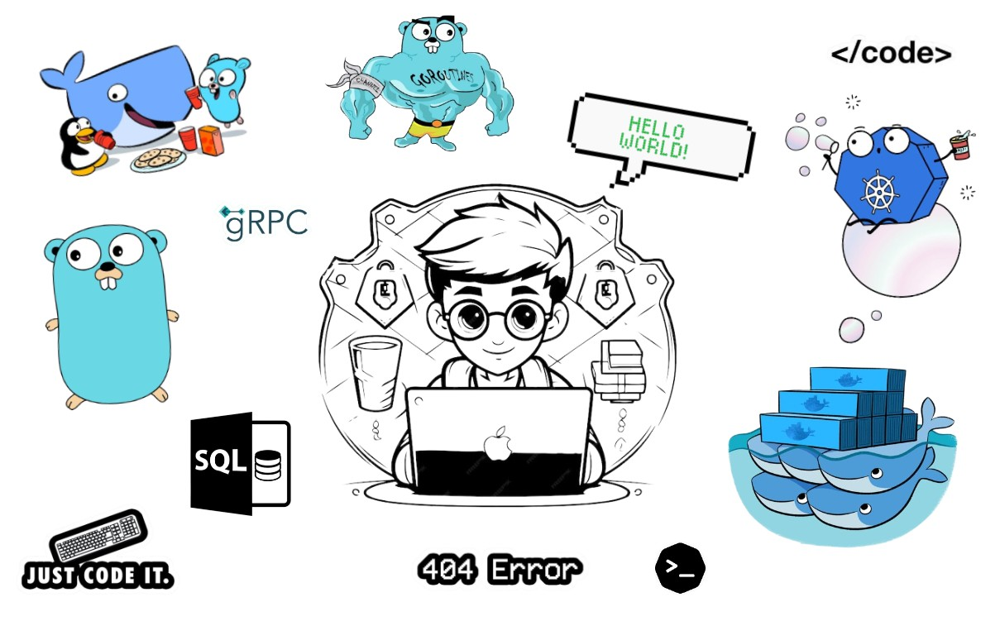

# Nagabhushana H K 🌟

<h1 align="center" style="font-size: 3rem; font-family: 'Segoe UI', Tahoma, Geneva, Verdana, sans-serif; color: skyblue; text-shadow: 0px 0px 20px skyblue, 0px 0px 30px deepskyblue;">
  🌟 Nagabhushana H K 🌟
</h1>

  

---

## 👨‍💻 Technical Skills

  
  
  
  
  
  

  
  
  
  
  

---

## 🌟 About Me

  🚀 Always eager to solve challenges and explore new technologies.  
  💡 Strong believer in clean code and scalable systems.  
  🤝 Open to collaborations on exciting projects and ideas.

---

## 🌐 Let's Connect!

  
  
  

<!-- Glow Effect Header -->
<h1 align="center" style="font-size: 3rem; font-family: 'Segoe UI', Tahoma, Geneva, Verdana, sans-serif; color: skyblue; text-shadow: 0px 0px 20px skyblue, 0px 0px 30px deepskyblue;">
  🌟 Nagabhushana H K 🌟
</h1>

<!-- Image Section -->

  

<!-- Technical Skills -->

    
    
    
    
    
    
    
    
    
    
    

<!-- About Me -->

    

        🚀 Always eager to solve challenges and explore new technologies.  
        💡 Strong believer in clean code and scalable systems.  
        🤝 Open to collaborations on exciting projects and ideas.
    

<!-- Connect -->

    
    
    

